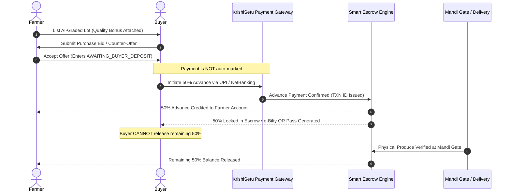

# 🌾 KrishiSetu AI (कृषिसेतु)
### *Next-Generation AI-Powered Agritech Marketplace & Smart Escrow Platform*


**KrishiSetu AI** is a comprehensive full-stack agricultural commerce and intelligence ecosystem engineered to eliminate predatory middlemen, deliver automated AI crop quality grading, guarantee equitable price discovery across mandis, and protect transactions using a tamper-proof **Two-Stage 50%-50% Smart Escrow** protocol.

---

## 📌 Table of Contents
1. [Target Beneficiaries & Impact](#-target-beneficiaries--impact)
2. [Key Features & Capabilities](#-key-features--capabilities)
3. [Architecture & Tech Stack](#-architecture--tech-stack)
4. [Smart Escrow & Payment Workflow](#-smart-escrow--payment-workflow)
5. [System Requirements & Prerequisites](#-system-requirements--prerequisites)
6. [Local Installation & Setup Guide](#-local-installation--setup-guide)
7. [Environment Variables](#-environment-variables)
8. [Folder Structure](#-folder-structure)
9. [Project Roadmap](#-project-roadmap)
10. [License & Contributors](#-license--contributors)

---

## 👥 Target Beneficiaries & Impact

### 1. Smallholder & Marginal Farmers (किसान)
* **The Problem**: Lack of transparent mandi rate visibility, arbitrary visual deductions by local aggregators, and prolonged payment defaults.
* **How KrishiSetu Helps**:
  * **Multilingual Voice AI Assistant** (supporting 7+ regional Indian languages: Hindi, Tamil, Telugu, Marathi, Kannada, Punjabi, English) acts as a farming advisor and negotiates prices.
  * **Computer Vision AI Lot Grading**: Analyzes crop images for freshness, color uniformity, size, and defects, automatically assigning a certified quality bonus (`+₹1.50 - ₹3.00/kg`).
  * **Net Profit Optimizer**: Calculates real take-home earnings by evaluating mandi price spreads minus exact logistics and fuel costs.
  * **Guaranteed 50% Upfront Bank Deposit**: Eliminates distress selling and financial default.

### 2. Institutional Buyers, Food Processors & Retailers (खरीदार)
* **The Problem**: Fragmented supply chains, unverified produce quality at distant farms, and manual payment reconciliations.
* **How KrishiSetu Helps**:
  * Direct farm-to-factory procurement with verifiable AI quality audit scores.
  * Instant counter-bidding and interactive price negotiations.
  * Secure integrated payment gateway for instant 50% advance deposits (UPI, Net Banking, Corporate Cards).
  * Digital **e-Bilty QR Gate Passes** for automated mandi check-in and tamper-proof shipment tracking.

### 3. FPOs (Farmer Producer Organizations) & Mandi Authorities
* **How KrishiSetu Helps**:
  * Aggregates member produce lots for bulk logistics optimization.
  * Verifies arrival weight and condition at gate before releasing the final 50% balance.

---

## 🚀 Key Features & Capabilities

### 🧠 1. AI Farm Advisor & ChatGPT-Grade Voice Chat
* **Domain-Expert AI**: Provides conversational farming insights covering pest prevention, soil health, fertilizer scheduling, weather alerts, and crop pricing strategies.
* **Voice-First Accessibility**: Voice input/output with native text-to-speech for rural accessibility.
* **Context-Aware Responses**: Formats actionable agronomy tips, market warnings, and harvesting recommendations.

### 📸 2. Computer Vision Crop Quality Assessor
* Real-time image upload with instant quality diagnosis.
* Estimates **Freshness Score**, **Color Uniformity**, and **Size Grade** (Grade A, B, or C).
* Translates quality parameters directly into financial upside via certified premium bonuses.

### ⚖️ 3. Real-Time Bid Negotiations
* Farmer and buyer can enter live, multi-turn price negotiations.
* Allows either party to submit counter-offers with customized negotiation remarks.
* Real-time notification banners alert buyers and farmers to review and respond.

### 🛡️ 4. Two-Stage 50%-50% Smart Escrow System
* **Step 1 (Agreement)**: Farmer accepts buyer's offer. The order is locked without marking payment as completed.
* **Step 2 (Buyer 50% Gateway Deposit)**: Buyer pays 50% advance via an interactive Payment Gateway (UPI / NetBanking / Cards).
* **Step 3 (Instant Advance Transfer)**: The 50% advance is credited to the farmer's account; remaining 50% is secured in escrow.
* **Step 4 (Delivery Verification)**: Buyer is strictly restricted from releasing the second half on their own. The final 50% can **only** be released by Mandi Gate verification or Farmer delivery confirmation upon physical produce receipt.
* **Digital e-Bilty QR Gate Pass**: Generates scannable QR passes for seamless mandi checkpoint clearance.

### 📊 5. Market Price Comparisons & Logistics Optimizer
* Compare live prices across nearby mandis (e.g., Coimbatore, Madurai, Tiruppur, Salem).
* Recommends optimal transport vehicle options (Tractor Trailer, Mini Truck, Heavy Truck) factoring in distance, payload, and fuel consumption.

---

## 🛠️ Architecture & Tech Stack

### Frontend
* **Core**: React 19, JavaScript (ESNext)
* **Build Tooling**: Vite 8 with Hot Module Replacement (HMR)
* **Styling**: TailwindCSS 3, Lucide React icons
* **Internationalization**: i18next (7 Indian languages)
* **PWA**: `vite-plugin-pwa` with offline caching and Workbox service workers

### Backend
* **Runtime**: Node.js, Express 5, TypeScript
* **Database**: **MongoDB Atlas** (Cloud Replica Set)
* **ODM**: Mongoose 9
* **AI Engine**: Google Gemini API (`@google/generative-ai`), Custom Heuristic Fallback Engine
* **Cloud Storage**: Cloudinary (Produce lot images)

---

## 🔒 Smart Escrow & Payment Workflow



---

## 💻 System Requirements & Prerequisites

* **Node.js**: v18.0.0 or higher (`v20.x` recommended)
* **npm**: v9.0.0 or higher
* **Git**: Installed and configured on your system
* **MongoDB Atlas Account**: Free tier cluster or higher

---

## 🚀 Local Installation & Setup Guide

### 1. Clone the Repository
```bash
git clone https://github.com/Lakshya06-kul/krishiSetu.git
cd krishiSetu
```

### 2. Frontend Setup
```bash
# Install root frontend dependencies
npm install

# Start the Vite development server
npm run dev
```
The frontend will be live at `http://localhost:5173/`.

### 3. Backend Setup
```bash
# Open a new terminal and navigate to the backend directory
cd backend

# Install backend dependencies
npm install

# Create environment file from example template
cp .env.example .env
```

Open `backend/.env` and ensure your credentials are set:
```env
PORT=5000
MONGODB_URI="mongodb+srv://<username>:<password>@cluster0.dykyii2.mongodb.net/krishisetu?retryWrites=true&w=majority&appName=Cluster0"
JWT_SECRET="your_jwt_secret_key_here"
```

Start the backend server:
```bash
# Run in development mode with nodemon & ts-node
npm run dev
```
The backend API will start at `http://localhost:5000/` and connect to your MongoDB Atlas cluster:
```text
✅ [MongoDB Atlas] Successfully connected to KrishiSetu cluster
```

### 4. Build for Production
```bash
# In project root
npm run build
```

---

## 📂 Folder Structure

```text
KrishiSetu-Ai/
├── backend/
│   ├── src/
│   │   ├── config/
│   │   │   ├── db.ts               # MongoDB Atlas connection & DNS handler
│   │   │   ├── cloudinary.ts       # Cloudinary media config
│   │   │   └── supabase.ts
│   │   ├── models/
│   │   │   ├── User.ts             # Mongoose User model
│   │   │   ├── ProduceLot.ts       # Produce lot schema & grades
│   │   │   ├── BuyerOffer.ts       # 50-50 Escrow offer schema
│   │   │   └── index.ts
│   │   ├── routes/                 # Express API routes
│   │   ├── controllers/            # Request handlers
│   │   └── app.ts                  # Server entry point
│   ├── .env.example
│   └── package.json
├── src/
│   ├── components/
│   │   ├── cards/
│   │   │   ├── BuyerCard.jsx       # Offer management, Gateway Modal & Official APMC Pass
│   │   │   ├── LotCard.jsx
│   │   │   └── MarketCard.jsx
│   │   └── common/
│   │       ├── Header.jsx          # Role switcher & language selector
│   │       ├── CommodityTicker.jsx # Live marquee mandi rate ribbon
│   │       ├── BiometricCropScanner.jsx # Laser beam & CV quality scanner
│   │       ├── LogisticsRouteMap.jsx    # Interactive Leaflet GIS route map
│   │       └── VoiceFAB.jsx        # Floating voice assistant
│   ├── screens/
│   │   ├── AIChatScreen.jsx        # Farm Advisor ChatGPT-style AI
│   │   ├── AIRecommendationScreen.jsx
│   │   ├── BuyerDashboardScreen.jsx # Escrow financial tracking
│   │   ├── BuyerMarketplaceScreen.jsx
│   │   ├── CreateLotScreen.jsx     # Produce upload & image diagnosis
│   │   ├── FarmerDashboardScreen.jsx
│   │   └── LogisticsScreen.jsx     # Fleet directory & transit router
│   ├── context/
│   │   └── AppContext.jsx          # Global state & Escrow business logic
│   ├── services/
│   │   ├── aiEngine.js             # Profit optimization engine
│   │   ├── aiService.js            # Regional LLM prompt generator
│   │   ├── soundboxService.js      # Web Audio celebratory confirmation chime
│   │   └── mockData.js             # Mock seed data & crop asset resolver
│   ├── App.jsx
│   └── main.jsx
├── PROJECT_ROADMAP.md
├── package.json
├── vite.config.js
└── README.md
```

---

## 🗺️ Project Roadmap
- [x] **Step 1: AI Chat Assistant** (Voice-activated agricultural ChatGPT with multi-language capabilities).
- [x] **Step 2: Dynamic Produce Lot Management** (Crop image matching, grading, and instant listing).
- [x] **Step 3: Buyer Marketplace & Multi-Turn Price Negotiations**.
- [x] **Step 4: Smart Escrow Protocol** (50% buyer advance via payment gateway + remaining 50% locked until gate receipt).
- [x] **Step 5: Cloud Database Sync** (MongoDB Atlas cluster integration with Mongoose ODM).
- [x] **Step 6: Commercial-Grade UI/UX & Visual Polish**:
  - [x] *Step 6.1*: Live Commodity Ticker Ribbon (Continuous animated marquee showing real-time mandi prices).
  - [x] *Step 6.2*: Biometric AI Crop Scanner (Animated laser beam overlay with dynamic computer vision bounding boxes).
  - [x] *Step 6.3*: Interactive GIS Route Map (Leaflet highway path, mileage, transit duration, and toll/fuel calculator).
  - [x] *Step 6.4*: Official APMC Digital Gate Pass (Authenticated rubber stamp watermark, realistic SVG barcode, SHA-256 seal).
  - [x] *Step 6.5*: Web Audio Payment Chime (Celebratory major arpeggio confirmation tone upon payment).
  - [x] *Step 6.6*: Commercial-Grade Login Portal (Glassmorphic authentication card, 1-click evaluator demo logins, interactive role picker, and dynamic social proof).
- [ ] **Step 7: Real-time WebSockets** (Instant bid notifications via Socket.io/Pusher).

---

## 📜 License & Acknowledgements
Developed with ❤️ for the agricultural community.
Proudly built for SIH (Smart India Hackathon).
Licensed under the [MIT License](LICENSE).
